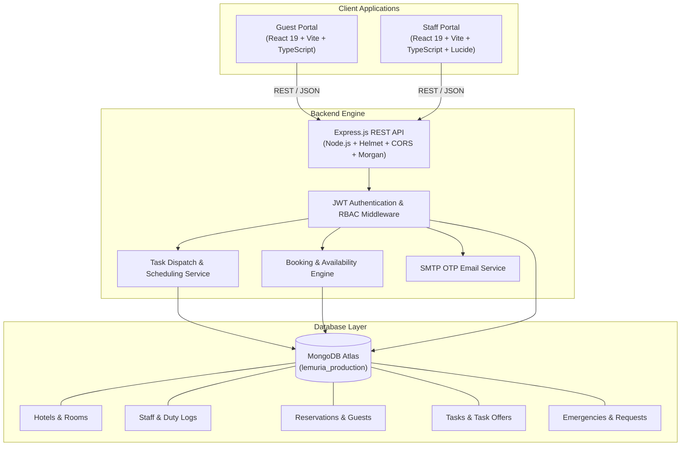

# LEMURIA — Hotel Management System

An enterprise-grade, multi-property luxury Hotel Management System (HMS) with full tenant isolation across properties, real-time staff task dispatching, and a self-service digital guest experience.

---

## Overview

**LEMURIA** is a modern, unified hotel operations and guest experience platform engineered for multi-property luxury hospitality groups. Traditional hotel management systems suffer from fragmented operational silos, delayed task delegation, and disjointed guest services. 

LEMURIA solves these challenges through:
1. **Strict Multi-Property Tenant Isolation**: Clean cryptographic and referential separation across hotel properties (e.g., Lemuria Grand, Lemuria Bay, Lemuria Hills).
2. **Automated Operational Dispatch Engine**: Real-time task allocation with a 15-second worker offer window, cascading reassignment, and queue preservation.
3. **Guest Stay Lifecycle Automation**: From availability-checked reservations and pending check-ins to room access unlocking, in-stay service requests, emergency broadcasting, and automatic checkout turnover tasks.

---

## Key Features

### Guest Portal
- **Hotel & Inventory Discovery**: Browse property portfolios (Chennai, Goa, Ooty), explore room categories, view live starting rates, review amenities, dining options, and facilities.
- **Real-Time Booking Availability**: Query exact room availability over selected calendar date ranges with real-time overlap collision prevention.
- **Guest Authentication**: Dual login options via One-Time Password (OTP) delivered via Gmail SMTP (with development fallback) or standard password authentication.
- **Reservation & Payment Flow**: Create reservations with occupancy rules, guest details, and instant booking confirmations with unique reservation codes (`LEM-XXXXXX`).
- **Digital Check-in Workflow**: Request digital check-in (`CHECK_IN_PENDING`) and receive instant room and keycard PIN access upon reception approval (`CHECKED_IN`).
- **Live Stay Hub**: Access room details, Wi-Fi credentials, stay dates, and active service controls unlocked exclusively during active check-in status.
- **On-Demand Service Requests**: Submit targeted departmental requests for Housekeeping (linens, amenities), Maintenance (climate, repairs), and Food & Beverage (in-room dining).
- **Critical Emergency Broadcasting**: Raise instantaneous critical emergency requests (`EMG-XXXX`) with high-priority staff notification delivery.
- **Real-Time Notifications**: View order updates, check-in status confirmations, and operational announcements with mark-as-read controls.
- **Guest Feedback & Ratings**: Submit 5-star ratings and structured reviews for overall hotel stay and individual department services upon checkout.
- **Booking History & Profile Management**: Track historical, active, and upcoming stays with complete guest isolation.

---

### Staff Portal
- **Role-Based & Departmental Access Control (RBAC)**: Fine-grained authorization tailored for `MANAGER`, `RECEPTION`, `HOUSEKEEPING`, `MAINTENANCE`, and `FOOD_AND_BEVERAGE` roles.
- **Staff Authentication**: Secure login via unique staff codes (e.g., `GRD-MG-001`, `BAY-HK-001`) or corporate email addresses with Bcrypt encryption.
- **Duty State Management**: Toggle staff shift states (`ON_DUTY` / `OFF_DUTY`) and track availability status (`AVAILABLE` vs. `BUSY`).
- **Real-Time Task Dispatch & Offers**: Automated task generation offering cleaning, maintenance, and dining tickets to eligible on-duty staff with a 15-second countdown timer.
- **Task Offer Resolution**: Accept, decline, or timeout task offers with automatic re-dispatch to next eligible on-duty colleagues.
- **Task Execution Flow**: Transition tasks seamlessly from `PENDING` → `ACCEPTED` → `IN_PROGRESS` → `COMPLETED`.
- **Reception Desk Operations**: Manage daily guest arrivals, verify identity and payment credentials, and approve digital check-ins and check-outs.
- **Automated Turnover Tasks**: Processing a guest checkout immediately triggers a high-priority Housekeeping cleaning task for that room.
- **Emergency Response Center**: Monitor live emergency broadcasts, acknowledge active alerts, and record resolution timestamps.
- **Manager Operations & Staff Management**: Add new staff, update employee records, modify account statuses (`ENABLED`, `DISABLED`, `SUSPENDED`), and monitor staff workload metrics.
- **Operational Reporting & Feedback Aggregation**: Review departmental ratings, guest comments, and property performance metrics.

---

## System Architecture



---

## Technology Stack

| Category | Technology | Purpose |
|---|---|---|
| **Frontend Framework** | React 19.2 | Core UI rendering engine for Guest & Staff Portals |
| **Language** | TypeScript (~6.0) | Strict type safety and interface contracts across portals |
| **Build Tool & Bundler** | Vite 8.3 | Fast dev server, Hot Module Replacement (HMR), optimized production build |
| **Routing** | React Router DOM 7.18 | Client-side routing for Staff Portal |
| **Icons & UI Assets** | Lucide React 1.48 | Iconography across portals |
| **Backend Framework** | Express 4.21 (Node.js) | Modular REST API server |
| **Database & ODM** | MongoDB Atlas / Mongoose 8.9 | Multi-tenant schema modelling, indexing, and aggregation |
| **Authentication & Security** | JSON Web Tokens (`jsonwebtoken` 9.0) | Stateless authentication tokens for Guest and Staff sessions |
| **Password Hashing** | BcryptJS 2.4 | Salted cryptographic password hashing |
| **Security Middleware** | Helmet 8.0 & CORS 2.8 | HTTP header hardening and cross-origin resource sharing |
| **Validation & Logging** | Morgan 1.10 & Express-Validator 7.3 | HTTP request logging and payload sanitization |
| **Email Delivery** | Nodemailer 6.9 | SMTP transport for Guest OTP authentication |
| **Real-Time Capabilities** | Socket.IO 4.8 | Low-latency bi-directional messaging support |
| **Testing Suite** | Node.js Test Runners | Real MongoDB Atlas integration test harnesses |

---

## Project Structure

```
LEMURIA/
├── BACKEND/                     # Express.js REST API server & database layer
│   ├── server.js                # Server entry point, middleware & graceful shutdown
│   ├── package.json             # Backend dependencies & script definitions
│   ├── .env.example             # Template for backend environment variables
│   ├── src/
│   │   ├── config/
│   │   │   └── db.js            # MongoDB connection manager & health checks
│   │   ├── controllers/         # Request handling & HTTP response orchestration
│   │   │   ├── authController.js
│   │   │   ├── emergencyController.js
│   │   │   ├── feedbackController.js
│   │   │   ├── hotelController.js
│   │   │   ├── managerController.js
│   │   │   ├── notificationController.js
│   │   │   ├── reservationController.js
│   │   │   ├── roomController.js
│   │   │   ├── serviceRequestController.js
│   │   │   ├── staffController.js
│   │   │   └── taskController.js
│   │   ├── middleware/          # Security, JWT auth, RBAC & error handlers
│   │   │   ├── auth.js
│   │   │   └── errorHandler.js
│   │   ├── models/              # Mongoose schema definitions
│   │   │   ├── AuditLog.js
│   │   │   ├── Counter.js
│   │   │   ├── DutyLog.js
│   │   │   ├── Emergency.js
│   │   │   ├── EmergencyRequest.js
│   │   │   ├── Feedback.js
│   │   │   ├── Guest.js
│   │   │   ├── Hotel.js
│   │   │   ├── Inspection.js
│   │   │   ├── Notification.js
│   │   │   ├── Otp.js
│   │   │   ├── Reservation.js
│   │   │   ├── Room.js
│   │   │   ├── RoomType.js
│   │   │   ├── ServiceRequest.js
│   │   │   ├── Staff.js
│   │   │   ├── Task.js
│   │   │   ├── TaskOffer.js
│   │   │   ├── User.js
│   │   │   └── index.js
│   │   ├── routes/              # Express API route modules
│   │   │   ├── authRoutes.js
│   │   │   ├── emergencyRoutes.js
│   │   │   ├── feedbackRoutes.js
│   │   │   ├── hotelRoutes.js
│   │   │   ├── index.js
│   │   │   ├── managerRoutes.js
│   │   │   ├── notificationRoutes.js
│   │   │   ├── reservationRoutes.js
│   │   │   ├── roomRoutes.js
│   │   │   ├── serviceRequestRoutes.js
│   │   │   ├── staffRoutes.js
│   │   │   └── taskRoutes.js
│   │   ├── services/            # Core business logic & scheduling
│   │   │   ├── authService.js
│   │   │   ├── bookingService.js
│   │   │   ├── otpService.js
│   │   │   ├── staffService.js
│   │   │   └── taskService.js
│   │   └── utils/               # Helpers, OTP generator & response formatters
│   │       ├── emailService.js
│   │       ├── otpGenerator.js
│   │       ├── response.js
│   │       └── seedData.js
│   └── tests/                   # Live MongoDB integration test suites
│       ├── test_runner.js
│       ├── test_staff_portal_integration.js
│       └── test_guest_portal_integration.js
├── GUEST PORTAL/                # Guest self-service web application
│   ├── index.html               # Web application HTML5 shell
│   ├── package.json             # Guest portal dependencies & scripts
│   ├── vite.config.ts           # Vite build configuration
│   ├── src/
│   │   ├── App.tsx              # Root component & view router
│   │   ├── index.css            # Design tokens & responsive styles
│   │   ├── components/          # Reusable UI components & modals
│   │   │   ├── BottomNav.tsx
│   │   │   ├── DevControls.tsx
│   │   │   ├── EmergencyButton.tsx
│   │   │   ├── EmergencyModal.tsx
│   │   │   ├── Header.tsx
│   │   │   ├── HotelArt.tsx
│   │   │   ├── ServiceRequestModal.tsx
│   │   │   └── Toast.tsx
│   │   ├── pages/               # Guest user interface views
│   │   │   ├── BookingConfirmedPage.tsx
│   │   │   ├── BookingDetailsPage.tsx
│   │   │   ├── BookingPage.tsx
│   │   │   ├── DashboardPage.tsx
│   │   │   ├── FeedbackPage.tsx
│   │   │   ├── HomePage.tsx
│   │   │   ├── HotelDetailPage.tsx
│   │   │   ├── HotelsPage.tsx
│   │   │   ├── LoginPage.tsx
│   │   │   ├── MyBookingsPage.tsx
│   │   │   ├── NotificationsPage.tsx
│   │   │   ├── ProfilePage.tsx
│   │   │   ├── RegisterPage.tsx
│   │   │   ├── RequestsPage.tsx
│   │   │   ├── ServicesPage.tsx
│   │   │   ├── StayHubPage.tsx
│   │   │   └── VerifyOtpPage.tsx
│   │   └── services/
│   │       └── api.ts           # Type-safe API client for Guest backend
├── STAFF PORTAL/                # Operations & management web application
│   ├── index.html               # Web application HTML5 shell
│   ├── package.json             # Staff portal dependencies & scripts
│   ├── vite.config.ts           # Vite build configuration
│   ├── src/
│   │   ├── App.tsx              # Root application & routing tree
│   │   ├── index.css            # Operational UI stylesheets
│   │   ├── components/          # Reusable operational components & dialogs
│   │   │   ├── AddFeedbackModal.tsx
│   │   │   ├── AddStaffModal.tsx
│   │   │   ├── BottomNav.tsx
│   │   │   ├── EditStaffModal.tsx
│   │   │   ├── EmergencyModal.tsx
│   │   │   ├── Pill.tsx
│   │   │   ├── Sidebar.tsx
│   │   │   ├── TaskCompleteModal.tsx
│   │   │   ├── TaskDetailModal.tsx
│   │   │   ├── TaskOfferModal.tsx
│   │   │   ├── Toast.tsx
│   │   │   ├── TopBar.tsx
│   │   │   └── VerifyGuestModal.tsx
│   │   ├── pages/               # Staff workflow views
│   │   │   ├── DashboardPage.tsx
│   │   │   ├── FeedbackPage.tsx
│   │   │   ├── LandingPage.tsx
│   │   │   ├── LoginPage.tsx
│   │   │   ├── NotificationsPage.tsx
│   │   │   ├── OperationsPage.tsx
│   │   │   ├── ReportsPage.tsx
│   │   │   ├── RequestsPage.tsx
│   │   │   ├── RoomsPage.tsx
│   │   │   ├── StaffManagementPage.tsx
│   │   │   └── TasksPage.tsx
│   │   └── services/
│   │       └── api.ts           # Type-safe API client for Staff backend
├── .gitignore                   # Root Git ignore definitions
└── README.md                    # Project documentation
```

---

## Backend Architecture

The backend follows a layered architecture with separation of concerns:

- **Routes (`src/routes/`)**: Define RESTful HTTP routes, attach URL parameters, and apply authentication and role-checking middleware.
- **Controllers (`src/controllers/`)**: Parse HTTP payloads, validate inputs, interact with domain services, and return standardized JSON responses.
- **Services (`src/services/`)**: Implement business logic such as booking date overlap collision detection (`bookingService.js`), cascading task offer timers (`taskService.js`), OTP generation and SMTP dispatch (`otpService.js`), and staff shift tracking (`staffService.js`).
- **Models (`src/models/`)**: Mongoose schemas defining MongoDB document structure, compound indexes, virtual getters, and lifecycle hooks.
- **Middleware (`src/middleware/`)**:
  - `authenticate`: Validates JWT Bearer tokens and hydrates `req.user`, `req.staff`, or `req.guest`.
  - `authorizeRole`: Enforces user role permissions (`GUEST` vs. `STAFF`).
  - `authorizeDepartment`: Restricts endpoints to specific operational departments (`MANAGER`, `RECEPTION`, `HOUSEKEEPING`, etc.).
  - `requireOnDuty`: Ensures operational staff are clocked in before accepting or modifying tasks.
  - `errorHandler`: Catches unhandled errors and formats clean HTTP error responses.
- **Utilities (`src/utils/`)**: Provides standardized API response wrappers (`response.js`), 6-digit OTP generator (`otpGenerator.js`), Nodemailer email service (`emailService.js`), and database seed utilities (`seedData.js`).
- **Database Configuration (`src/config/db.js`)**: Manages the connection to MongoDB Atlas, logs connection states, and exposes `getDBStatus()` for health probes.

---

## Database Schema & Models

LEMURIA models operational hospitality workflows across the following MongoDB collections:

1. **`Hotel`**: Represents physical properties (e.g., Lemuria Grand, Lemuria Bay, Lemuria Hills) with city, star rating, starting price, description, amenities, and `hotelCode` (`GRD`, `BAY`, `HIL`).
2. **`RoomType`**: Room categories linked to properties with bed configuration, max guest capacity, pricing per night, and category amenities.
3. **`Room`**: Physical hotel rooms linked to `hotelId` and `roomTypeId`, floor number, current state (`AVAILABLE`, `OCCUPIED`, `READY`, `CLEANING_REQUIRED`, `INSPECTED`), and current guest assignments.
4. **`Guest`**: Guest user accounts containing name, email, mobile phone number, masked ID proofs, and Bcrypt password hash.
5. **`Reservation`**: Booking records containing `reservationCode` (`LEM-XXXXXX`), check-in and check-out dates, status (`BOOKED`, `CHECK_IN_PENDING`, `CHECKED_IN`, `CHECKED_OUT`, `CANCELLED`), room assignment, keycard PIN, and payment details.
6. **`Staff`**: Staff accounts scoped by `hotelId`, `hotelCode`, and `hotelAccess` array. Contains `staffCode` (e.g., `GRD-HK-001`), department, role, duty status (`ON_DUTY` / `OFF_DUTY`), availability (`AVAILABLE` / `BUSY`), and current active task reference.
7. **`Task`**: Work tickets generated by manager requests, guest requests, or automatic checkout triggers. Tracks `taskCode` (`TSK-XXXXX`), hotel, department, priority, status (`PENDING`, `ACCEPTED`, `IN_PROGRESS`, `COMPLETED`, `CANCELLED`), and assigned staff.
8. **`TaskOffer`**: Real-time assignment offers dispatched to staff with a 15-second TTL expiration (`expiresAt`), recording acceptance, declines, or timeouts.
9. **`ServiceRequest`**: Guest service orders (`REQ-XXXXX`) categorized by department, tracking status from creation through fulfillment.
10. **`EmergencyRequest` / `Emergency`**: Urgent incident reports (`EMG-XXXX`) with room location, severity, acknowledgment timestamp, and resolution status.
11. **`Notification`**: In-app notifications targeting specific users, staff members, or operational departments.
12. **`Feedback`**: Guest ratings and reviews categorized by overall hotel stay or departmental service fulfillment.
13. **`Inspection`**: Room quality checklists completed by Housekeeping supervisors.
14. **`DutyLog`**: Audit trail of staff clock-in and clock-out timestamps and shift durations.
15. **`Counter`**: Atomic sequence counters for generating formatted document identifiers.
16. **`AuditLog`**: Security and compliance log tracking operational actions.
17. **`Otp`**: Ephemeral 6-digit authentication codes indexed with TTL for automated expiration.

### Multi-Property Isolation Model
Every operational record (`Room`, `Reservation`, `Task`, `Staff`, `ServiceRequest`, `EmergencyRequest`, `Feedback`, `Notification`) enforces `hotelId` scoping:
- Staff members can only query, accept, or perform tasks within their designated `hotelId`.
- Hotel queries strictly filter by property to ensure zero cross-tenant data leakage.

---

## Authentication & Authorization

### 1. Guest Authentication
- **OTP Verification Flow**:
  1. Guest submits email at `POST /api/auth/guest/otp/request`.
  2. System generates a secure 6-digit numerical OTP and transmits it via Nodemailer SMTP.
  3. Guest submits OTP at `POST /api/auth/guest/otp/verify`.
  4. Backend verifies OTP against MongoDB with expiry validation and issues a JWT token.
- **Password Authentication**:
  - Direct login with email and Bcrypt-verified password at `POST /api/auth/guest/login`.

### 2. Staff Authentication
- Staff authenticate using their unique `staffCode` (e.g., `GRD-MG-001`) or email address alongside their password at `POST /api/auth/staff/login`.
- Accounts flagged with `accountStatus: 'DISABLED'` or `accountStatus: 'SUSPENDED'` are rejected at the authentication gateway.

### 3. Role-Based & Departmental Access Control
- **`authorizeRole('GUEST')`**: Grants access to reservation creation, personal stay access, and guest service tickets.
- **`authorizeRole('STAFF')`**: Unlocks operational task execution, duty toggling, and emergency response.
- **`authorizeDepartment('MANAGER')`**: Restricted access for employee creation, workload monitoring, and property configuration.
- **`authorizeDepartment('RECEPTION')`**: Permits guest arrival verification, check-in approvals, and room keycard assignments.

---

## Operational Workflows

### Guest Stay Lifecycle

```
[Browse Hotels & Room Types]
              ↓
  [Select Dates & Room]
              ↓
[Check-in Date Collision Check] (Zero overlap)
              ↓
   [Create Reservation] ───→ Status: BOOKED
              ↓
 [Arrive & Request Check-in] → Status: CHECK_IN_PENDING
              ↓
[Reception Identity Verification & Approval]
              ↓
[Stay Access Unlocked] ──────→ Status: CHECKED_IN
  ├── Wi-Fi & Room Details
  ├── Housekeeping / F&B Requests
  └── Emergency Assistance
              ↓
      [Guest Checkout] ──────→ Status: CHECKED_OUT
              ↓
[Auto-Dispatch Housekeeping Turnover Task]
              ↓
   [Submit Stay Feedback]
```

---

### Staff Task Dispatch Lifecycle

```
       [Task Created] (Manual or Automated Checkout Trigger)
              ↓
    [Identify Eligible Staff] (Same Hotel + Department + ON_DUTY + AVAILABLE)
              ↓
  [Create Task Offer (15s Window)]
              ↓
      ┌───────┴────────────────────────┐
      ▼                                ▼
  [Accepted]                 [Declined / Timed Out]
      ↓                                ↓
[Task: ACCEPTED]              [Record in Decline History]
[Staff: BUSY]                          ↓
      ↓                     [Offer to Next Eligible Staff]
 [Start Task]
      ↓
[Task: IN_PROGRESS]
      ↓
[Complete Task]
      ↓
[Task: COMPLETED]
[Staff: AVAILABLE]
```

---

## API Reference

### 1. Authentication (`/api/auth`)
| Method | Endpoint | Purpose | Authorization |
|---|---|---|---|
| `POST` | `/api/auth/guest/otp/request` | Request 6-digit login OTP via email | Public |
| `POST` | `/api/auth/guest/otp/verify` | Verify OTP and receive Guest JWT | Public |
| `POST` | `/api/auth/guest/login` | Login with email and password | Public |
| `POST` | `/api/auth/guest/register` | Register new guest account | Public |
| `POST` | `/api/auth/staff/login` | Authenticate staff member by code/email | Public |
| `GET` | `/api/auth/me` | Retrieve profile of authenticated user | Bearer Token |

### 2. Hotels & Inventory (`/api/hotels`, `/api/rooms`)
| Method | Endpoint | Purpose | Authorization |
|---|---|---|---|
| `GET` | `/api/hotels` | Retrieve all active hotel properties | Public |
| `GET` | `/api/hotels/:id` | Retrieve specific hotel details | Public |
| `POST` | `/api/hotels` | Create new hotel property | Staff (MANAGER) |
| `GET` | `/api/rooms` | Retrieve all rooms across properties | Staff |
| `GET` | `/api/rooms/hotel/:hotelId` | Retrieve physical rooms for a property | Public |
| `GET` | `/api/rooms/availability/:hotelId` | Query room availability for date range | Public |
| `POST` | `/api/rooms` | Create new physical room | Staff (MANAGER) |
| `PATCH` | `/api/rooms/:id/status` | Update room status (CLEAN, DIRTY, etc.) | Staff |

### 3. Reservations & Stay Lifecycle (`/api/reservations`)
| Method | Endpoint | Purpose | Authorization |
|---|---|---|---|
| `POST` | `/api/reservations/book` | Book a room for specified dates | Guest |
| `GET` | `/api/reservations/my-bookings` | Retrieve authenticated guest reservations | Guest |
| `POST` | `/api/reservations/:id/request-checkin` | Submit digital check-in request | Guest |
| `GET` | `/api/reservations/hotel` | List property arrivals and departures | Staff (RECEPTION, MANAGER) |
| `POST` | `/api/reservations/:id/approve-checkin` | Approve guest check-in & issue PIN | Staff / Guest |
| `POST` | `/api/reservations/:id/checkout` | Process guest checkout & create cleaning task | Staff / Guest |

### 4. Tasks & Operations (`/api/tasks`)
| Method | Endpoint | Purpose | Authorization |
|---|---|---|---|
| `GET` | `/api/tasks` | Retrieve task list scoped to hotel | Staff |
| `POST` | `/api/tasks` | Create operational work task | Staff |
| `GET` | `/api/tasks/my-tasks` | Retrieve tasks assigned to current staff | Staff |
| `POST` | `/api/tasks/offers/:offerId/accept` | Accept 15-second task offer | Staff |
| `POST` | `/api/tasks/offers/:offerId/decline` | Decline task offer & pass to colleague | Staff |
| `POST` | `/api/tasks/offers/:offerId/timeout` | Handle expired offer timeout | Staff |
| `POST` | `/api/tasks/:id/start` | Transition task to IN_PROGRESS | Staff |
| `POST` | `/api/tasks/:id/complete` | Complete task and release staff | Staff |

### 5. Service Requests (`/api/service-requests`)
| Method | Endpoint | Purpose | Authorization |
|---|---|---|---|
| `POST` | `/api/service-requests` | Submit departmental service request | Guest, Staff |
| `GET` | `/api/service-requests/my-requests` | View requests for active guest stay | Guest |
| `GET` | `/api/service-requests/department` | View department service queue | Staff |

### 6. Emergency Alerts (`/api/emergency`)
| Method | Endpoint | Purpose | Authorization |
|---|---|---|---|
| `POST` | `/api/emergency` | Broadcast urgent emergency ticket | Guest, Staff |
| `GET` | `/api/emergency/active` | Monitor live emergency broadcasts | Staff |
| `POST` | `/api/emergency/:id/respond` | Acknowledge active emergency alert | Staff |
| `POST` | `/api/emergency/:id/resolve` | Resolve emergency ticket | Staff |

### 7. Staff Management & Workload (`/api/manager`, `/api/staff`)
| Method | Endpoint | Purpose | Authorization |
|---|---|---|---|
| `GET` | `/api/staff/me` | Fetch active staff profile and shift status | Staff |
| `POST` | `/api/staff/duty/start` | Clock-in and set state to ON_DUTY | Staff |
| `POST` | `/api/staff/duty/end` | Clock-out and set state to OFF_DUTY | Staff |
| `GET` | `/api/manager/staff` | List staff members for manager property | Staff (MANAGER) |
| `POST` | `/api/manager/staff` | Create new staff account | Staff (MANAGER) |
| `PUT` | `/api/manager/staff/:id` | Update staff details and department | Staff (MANAGER) |
| `PATCH` | `/api/manager/staff/:id/status` | Enable, disable, or suspend staff account | Staff (MANAGER) |
| `GET` | `/api/manager/workload` | Retrieve staff workload and duty metrics | Staff (MANAGER) |

### 8. Notifications & Feedback (`/api/notifications`, `/api/feedback`)
| Method | Endpoint | Purpose | Authorization |
|---|---|---|---|
| `GET` | `/api/notifications` | Fetch user notifications | Bearer Token |
| `PATCH` | `/api/notifications/:id/read` | Mark individual notification as read | Bearer Token |
| `POST` | `/api/notifications/read-all` | Mark all notifications as read | Bearer Token |
| `POST` | `/api/feedback` | Submit stay or service feedback review | Guest, Staff |
| `GET` | `/api/feedback` | Retrieve hotel feedback reports | Staff |

---

## Testing & Quality Assurance

The system includes test suites validating real MongoDB Atlas operations, multi-tenant isolation, and portal API contracts.

### Running Integration Tests

To run the backend integration test suites against the database:

```bash
# Navigate to the backend directory
cd BACKEND

# 1. Run core backend integration suite (23 operations)
node tests/test_runner.js

# 2. Run staff portal integration suite (20 operations)
node tests/test_staff_portal_integration.js

# 3. Run guest portal integration suite (24 operations)
node tests/test_guest_portal_integration.js
```

### Test Suite Coverage
- **`test_runner.js` (23 Tests)**: Verifies MongoDB connectivity, manager and staff logins, disabled account rejection, tenant isolation, guest registration, booking collision prevention, digital check-in/checkout, task dispatch, task offer acceptance/decline, emergency alerting, and feedback submission.
- **`test_staff_portal_integration.js` (20 Tests)**: Tests staff profile endpoints, shift clock-in/out, dashboard workload metrics, task lifecycle (creation, dispatch, 15-second timeout, start, complete), emergency response, manager staff CRUD, and session invalidation.
- **`test_guest_portal_integration.js` (24 Tests)**: Validates property browsing, date-range availability checks, reservation creation, double-booking rejection, keycard PIN generation, in-stay service requests, guest-to-guest isolation, and post-checkout access revocation.

---

## Local Development & Setup

### Prerequisites
- **Node.js**: v18.0 or higher (v20+ recommended)
- **npm**: v9.0 or higher
- **MongoDB Atlas** cluster or local MongoDB instance

### 1. Environment Configuration

Create `.env` files for each component from their respective examples:

```bash
# Backend configuration
cp BACKEND/.env.example BACKEND/.env

# Guest Portal configuration
cp "GUEST PORTAL/.env.example" "GUEST PORTAL/.env"

# Staff Portal configuration
cp "STAFF PORTAL/.env.example" "STAFF PORTAL/.env"
```

Configure `BACKEND/.env` with your database and SMTP credentials:
```env
PORT=5000
NODE_ENV=development
MONGODB_URI=mongodb+srv://<username>:<password>@<cluster>.mongodb.net/lemuria_production?retryWrites=true&w=majority
DB_NAME=lemuria_production
JWT_SECRET=your_secure_jwt_secret
FRONTEND_URL=http://localhost:5173,http://localhost:5174,http://localhost:5175

# Optional SMTP configuration for live OTP emails
SMTP_HOST=smtp.gmail.com
SMTP_PORT=587
SMTP_USER=your_email@gmail.com
SMTP_PASSWORD=your_app_password
OTP_EMAIL_FROM="Lemuria Hotel Services <your_email@gmail.com>"
```

### 2. Install Dependencies

```bash
# Install backend dependencies
cd BACKEND
npm install

# Install Guest Portal dependencies
cd "../GUEST PORTAL"
npm install

# Install Staff Portal dependencies
cd "../STAFF PORTAL"
npm install
```

### 3. Launch the Applications

Run each service in separate terminal instances:

```bash
# Terminal 1: Backend API Server (Port 5000)
cd BACKEND
npm run dev

# Terminal 2: Guest Portal (Port 5174)
cd "GUEST PORTAL"
npm run dev

# Terminal 3: Staff Portal (Port 5175)
cd "STAFF PORTAL"
npm run dev
```

---

## License

This project is licensed under the ISC License. Developed by the Lemuria Engineering Team.